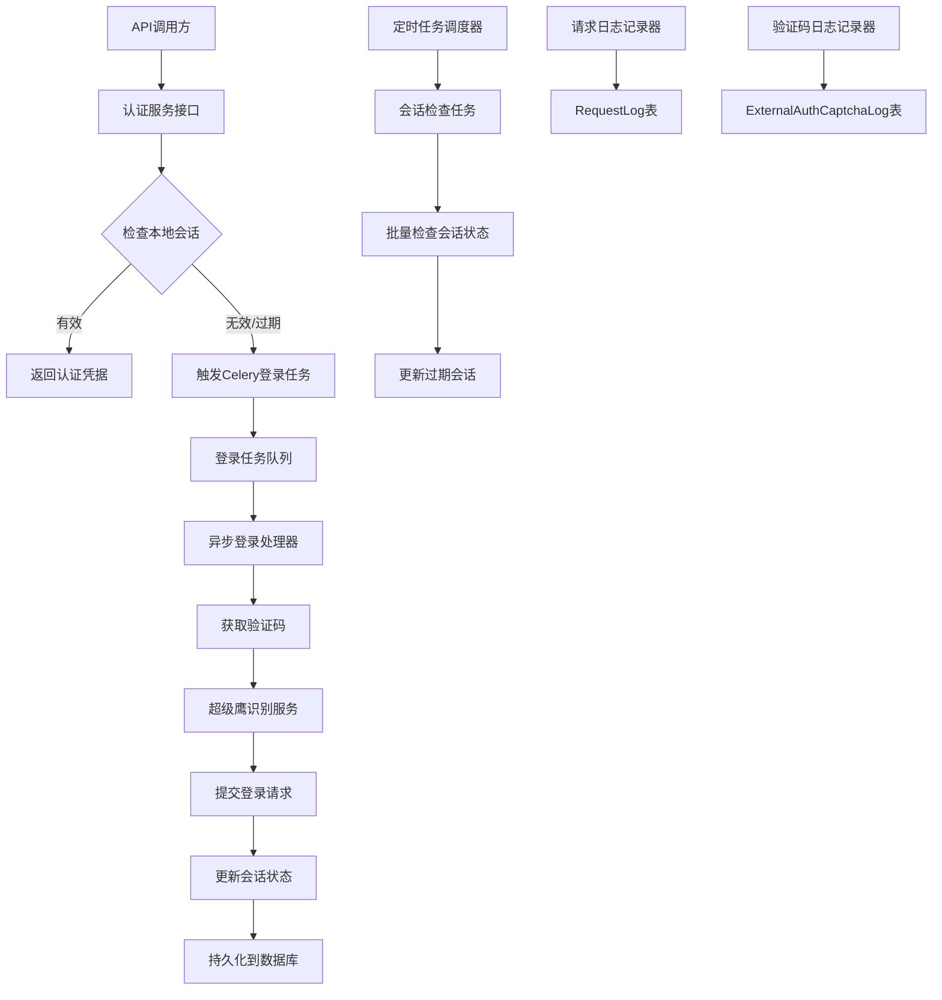

# 设计文档

## 概述

外部平台认证系统是一个基于Django和Celery的异步认证管理系统，专门用于处理市中心工单系统等外部平台的自动化登录和会话管理。系统采用异步任务架构，集成超级鹰验证码识别服务，提供可靠的认证状态维护和API访问能力。

## 架构

### 系统架构图



### 核心组件

1. **认证服务层 (AuthService)**
   - 提供统一的认证接口
   - 管理会话生命周期
   - 协调异步任务执行

2. **异步任务层 (Celery Tasks)**
   - 登录任务处理器
   - 定时会话检查任务
   - 会话清理任务

3. **验证码识别服务 (CaptchaClient)**
   - 集成超级鹰API
   - 处理验证码图片识别
   - 管理识别结果

4. **数据访问层 (Models)**
   - Platform: 外部平台配置
   - AuthSession: 认证会话管理
   - ApiEndpoint: API端点配置
   - RequestLog: 请求日志记录
   - ExternalAuthCaptchaLog: 验证码识别日志

## 组件和接口

### 1. 认证服务接口 (AuthService)

```python
class AuthService:
    def get_valid_session(self, platform_sign: str, account: str) -> Optional[AuthSession]
    def trigger_login_task(self, platform_sign: str, account: str, password: str) -> str
    def check_session_validity(self, session: AuthSession) -> bool
    def refresh_session_if_needed(self, session: AuthSession) -> AuthSession
```

### 2. Celery异步任务

```python
@shared_task(bind=True, max_retries=3)
def perform_login_task(self, platform_sign: str, account: str, password: str)

@periodic_task(run_every=crontab(minute='*/10'))
def check_sessions_status()

@periodic_task(run_every=crontab(hour=2, minute=0))
def cleanup_expired_sessions()
```

### 3. 验证码识别客户端

```python
class CaptchaClient:
    def __init__(self, username: str, password: str, software_id: str)
    def post_image(self, image_data: bytes, captcha_type: int) -> dict
    def get_balance(self) -> dict
    def report_error(self, pic_id: str) -> dict
```

### 4. API端点管理器

```python
class EndpointManager:
    def get_endpoint_config(self, platform_sign: str, endpoint_name: str) -> Optional[ApiEndpoint]
    def get_fallback_config(self, platform_sign: str, endpoint_name: str) -> dict
    def make_authenticated_request(self, endpoint_config: dict, session: AuthSession, **kwargs) -> dict
```

## 数据模型

### 会话数据结构 (AuthSession.auth字段)

```json
{
    "cookies": {
        "JSESSIONID": "xxx",
        "PHPSESSID": "yyy"
    },
    "headers": {
        "User-Agent": "Mozilla/5.0...",
        "Referer": "https://example.com"
    },
    "tokens": {
        "csrf_token": "abc123",
        "access_token": "def456"
    },
    "login_info": {
        "last_login_ip": "192.168.1.1",
        "login_method": "captcha"
    }
}
```

### 请求日志标签结构 (RequestLog.tag字段)

```json
{
    "request_type": "login|api_call|captcha",
    "retry_count": 0,
    "task_id": "celery-task-uuid",
    "captcha_type": 1004,
    "captcha_cost": 0.1
}
```

## 错误处理

### 错误类型定义

```python
class AuthenticationError(Exception):
    """认证相关错误基类"""
    pass

class SessionExpiredError(AuthenticationError):
    """会话过期错误"""
    pass

class CaptchaRecognitionError(AuthenticationError):
    """验证码识别错误"""
    pass

class PlatformUnavailableError(AuthenticationError):
    """平台不可用错误"""
    pass
```

### 错误处理策略

1. **网络错误**: 指数退避重试，最多3次
2. **验证码错误**: 重新获取验证码，最多5次尝试
3. **认证失败**: 记录错误，暂停该账户10分钟
4. **平台维护**: 标记平台状态，延迟重试

## 测试策略

### 单元测试

1. **模型测试**
   - 数据验证和约束测试
   - 关系完整性测试
   - 软删除功能测试

2. **服务层测试**
   - 认证逻辑测试
   - 会话管理测试
   - 错误处理测试

3. **异步任务测试**
   - 任务执行逻辑测试
   - 重试机制测试
   - 并发安全测试

### 集成测试

1. **端到端认证流程测试**
2. **验证码识别集成测试**
3. **数据库事务一致性测试**
4. **Celery任务队列测试**

### 性能测试

1. **并发登录测试**
2. **大量会话管理测试**
3. **数据库查询性能测试**
4. **内存使用监控测试**

## 配置管理

### Django设置

```python
# Celery配置
CELERY_BROKER_URL = 'redis://localhost:6379/0'
CELERY_RESULT_BACKEND = 'redis://localhost:6379/0'

# 超级鹰配置
CHAOJIYING_CONFIG = {
    'username': 'your_username',
    'password': 'your_password',
    'software_id': 'your_software_id',
    'default_captcha_type': 1004
}

# 认证配置
AUTH_CONFIG = {
    'session_timeout_hours': 24,
    'max_retry_attempts': 3,
    'captcha_retry_limit': 5,
    'session_check_interval_minutes': 10
}
```

### 临时端点配置 (开发阶段)

```python
TEMP_ENDPOINTS = {
    'city_center_work_order': {
        'captcha_url': 'https://example.com/captcha',
        'login_url': 'https://example.com/login',
        'check_url': 'https://example.com/check_session',
        'base_headers': {
            'User-Agent': 'Mozilla/5.0 (Windows NT 10.0; Win64; x64) AppleWebKit/537.36'
        }
    }
}
```

## 部署考虑

### 依赖服务

1. **Redis**: Celery消息队列和结果存储
2. **PostgreSQL/MySQL**: 主数据库
3. **超级鹰API**: 验证码识别服务

### 监控指标

1. **业务指标**
   - 登录成功率
   - 验证码识别准确率
   - 会话有效时长
   - API调用响应时间

2. **技术指标**
   - Celery任务队列长度
   - 数据库连接池状态
   - 内存和CPU使用率
   - 错误日志频率

### 扩展性考虑

1. **水平扩展**: 支持多个Celery worker节点
2. **数据分片**: 按平台或时间分片存储日志
3. **缓存策略**: Redis缓存热点会话数据
4. **负载均衡**: API接口支持负载均衡部署