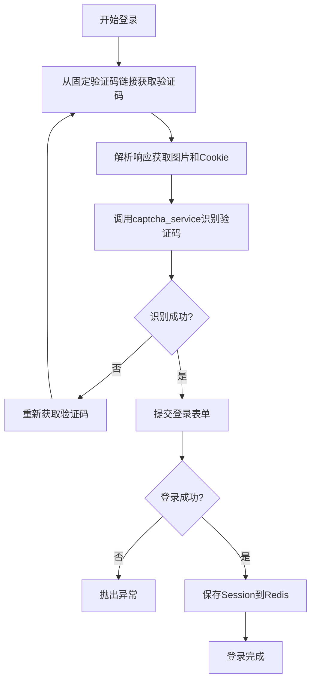
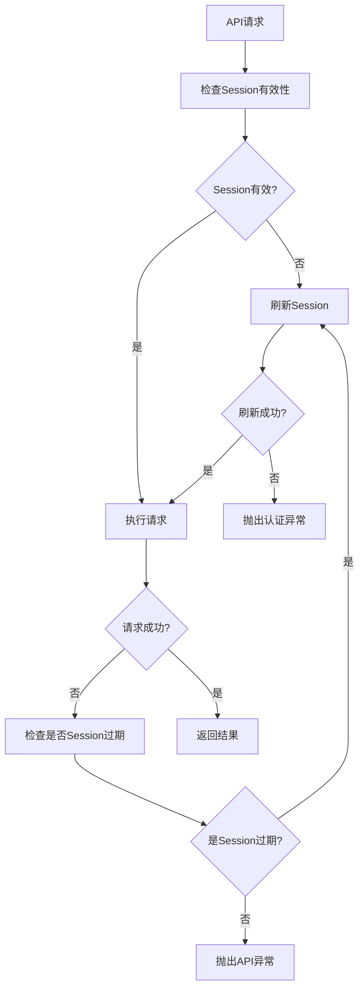
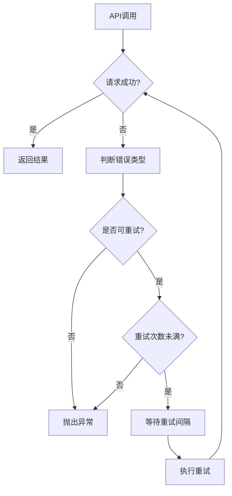

# 平台网关SDK设计文档

## 1. 概述

平台网关SDK是一个集成到DRF项目中的内部组件，用于简化与使用cookie + session认证的外部平台的集成。该组件自动处理认证复杂性、会话管理，并为开发人员提供清洁的Python API来与外部平台交互。

### 1.1 设计目标

- **简化集成**：提供统一的Python接口，屏蔽目标平台的会话管理与接口差异
- **自动化认证**：内部自动完成登录、保活、session刷新
- **验证码处理**：自动处理验证码识别，调用外部打码服务
- **高可用性**：使用Redis存储会话数据，支持多进程共享
- **任务自动化**：使用Celery实现保活任务，保证session持续有效

### 1.2 核心特性

- 透明的会话管理
- 自动验证码解决
- 多进程会话共享
- 自动保活机制
- 标准化错误处理
- 配置化管理

## 2. 系统架构

### 2.1 整体架构

```
┌─────────────────┐    ┌─────────────────┐    ┌─────────────────┐
│   业务代码      │    │   网关SDK       │    │   外部平台      │
│                 │    │                 │    │                 │
│ from gateway    │───▶│ API Wrappers    │───▶│ Platform APIs   │
│ import get_user │    │                 │    │                 │
│                 │    │ Session Manager │    │ Cookie+Session  │
└─────────────────┘    └─────────────────┘    └─────────────────┘
           │                       │                       │
           │                       ▼                       │
           │            ┌─────────────────┐                │
           │            │     Redis       │                │
           │            │ Session Storage │                │
           │            └─────────────────┘                │
           │                       │                       │
           │                       ▼                       │
           │            ┌─────────────────┐                │
           │            │     Celery      │                │
           └────────────│ Keepalive Tasks │────────────────┘
                        └─────────────────┘
```

### 2.2 模块结构

```
backend/gateway/
├── __init__.py
├── services.py          # SessionManager核心服务（包含验证码处理）
├── api_wrappers.py      # 平台API封装层
├── utils.py             # 通用工具函数（序列化、时间戳等）
├── tasks.py             # Celery保活任务
├── exceptions.py        # 自定义异常
├── config.py            # 配置管理
└── models.py            # 数据模型（如需要）
```

## 3. 核心组件设计

### 3.1 SessionManager (services.py)

负责会话生命周期管理的核心组件。

#### 3.1.1 类设计

```python
class SessionManager:
    def __init__(self, redis_client, config):
        """初始化会话管理器"""
        self.redis_client = redis_client
        self.config = config
        self.session = requests.Session()
        
    def login(self) -> bool:
        """执行登录流程，直接从固定验证码链接获取验证码"""
        try:
            # 步骤1: 获取验证码图片和Cookie
            captcha_url = self._build_captcha_url()
            image_data, cookies = self._get_captcha_image(captcha_url)
            
            # 步骤2: 识别验证码
            captcha_text = self._solve_captcha(image_data)
            
            # 步骤3: 执行登录
            login_success = self._perform_login(captcha_text, cookies)
            
            if login_success:
                # 保存会话到Redis
                self.save_session(self.session.cookies.get_dict())
                return True
            return False
            
        except Exception as e:
            logger.error(f"登录失败: {e}")
            return False
    
    def _build_captcha_url(self) -> str:
        """构建验证码URL，包含随机参数"""
        import time
        import random
        
        base_url = self.config.get('captcha_base_url')
        timestamp = int(time.time() * 1000) + random.randint(1000, 9999)
        return f"{base_url}?t={timestamp}"
    
    def _get_captcha_image(self, captcha_url: str) -> tuple:
        """从固定链接获取验证码图片和Cookie"""
        response = self.session.get(captcha_url)
        response.raise_for_status()
        
        return response.content, response.cookies.get_dict()
    
    def _solve_captcha(self, image_data: bytes) -> str:
        """调用captcha_service识别验证码"""
        from common.captcha_service import get_captcha_service
        
        captcha_service = get_captcha_service()
        if not captcha_service:
            raise CaptchaError("验证码服务不可用")
        
        # 默认使用1004类型(英数字混合)
        captcha_type = self.config.get('captcha_type', 1004)
        result = captcha_service.recognize_captcha(image_data, captcha_type)
        
        if result.get('err_no') != 0:
            raise CaptchaError(f"验证码识别失败: {result.get('err_str')}")
        
        return result.get('pic_str', '')
    
    def _perform_login(self, captcha_text: str, cookies: dict) -> bool:
        """执行登录请求"""
        # 更新session的cookies
        self.session.cookies.update(cookies)
        
        login_data = {
            'username': self.config.get('username'),
            'password': self.config.get('password'),
            'captcha': captcha_text,
            # 根据实际平台需要添加其他字段
        }
        
        login_url = self.config.get('login_url')
        response = self.session.post(login_url, data=login_data)
        
        # 根据实际响应格式判断登录是否成功
        return self._check_login_success(response)
        
    def refresh(self) -> bool:
        """刷新过期会话"""
        
    def request(self, method: str, path: str, **kwargs) -> requests.Response:
        """底层请求方法，自动注入cookie和处理会话过期"""
        
    def is_session_valid(self) -> bool:
        """检查会话是否有效"""
        
    def save_session(self, cookies: dict):
        """保存会话到Redis"""
        
    def load_session(self) -> dict:
        """从Redis加载会话"""
```

#### 3.1.2 登录流程



#### 3.1.3 请求流程



### 3.2 API封装层 (api_wrappers.py)

提供业务友好的API接口。

#### 3.2.1 设计模式

```python
class PlatformAPI:
    def __init__(self):
        self.session_manager = SessionManager()
    
    def get_user_info(self, user_id: str) -> dict:
        """获取用户信息"""
        response = self.session_manager.request(
            'GET', 
            f'/api/user/{user_id}'
        )
        return self._parse_response(response)
    
    def submit_order(self, order_data: dict) -> dict:
        """提交订单"""
        response = self.session_manager.request(
            'POST', 
            '/api/order', 
            json=order_data
        )
        return self._parse_response(response)
    
    def keepalive(self) -> bool:
        """保活接口"""
        try:
            response = self.session_manager.request('GET', '/api/heartbeat')
            return response.status_code == 200
        except Exception:
            return False
    
    def _parse_response(self, response: requests.Response) -> dict:
        """统一响应解析"""
        if response.status_code != 200:
            raise PlatformAPIError(f"API调用失败: {response.status_code}")
        return response.json()
```

#### 3.2.2 单例模式实现

```python
# 全局API实例
api_instance = None

def get_api_instance() -> PlatformAPI:
    global api_instance
    if api_instance is None:
        api_instance = PlatformAPI()
    return api_instance

# 便捷函数
def get_user_info(user_id: str) -> dict:
    return get_api_instance().get_user_info(user_id)

def submit_order(order_data: dict) -> dict:
    return get_api_instance().submit_order(order_data)
```

### 3.3 工具函数 (utils.py)

### 3.4 保活任务 (tasks.py)

#### 3.4.1 Celery任务设计

```python
from celery import shared_task
from django.conf import settings
import logging

logger = logging.getLogger(__name__)

@shared_task(bind=True, max_retries=3)
def keepalive_task(self):
    """保活任务"""
    try:
        from .api_wrappers import get_api_instance
        
        api = get_api_instance()
        success = api.keepalive()
        
        if not success:
            logger.warning("保活失败，尝试刷新会话")
            api.session_manager.refresh()
            
        logger.info("保活任务执行成功")
        return True
        
    except Exception as exc:
        logger.error(f"保活任务执行失败: {exc}")
        # 指数退避重试
        raise self.retry(exc=exc, countdown=60 * (2 ** self.request.retries))

@shared_task
def schedule_keepalive():
    """调度保活任务"""
    interval = getattr(settings, 'GATEWAY_KEEPALIVE_INTERVAL', 300)  # 默认5分钟
    keepalive_task.apply_async(countdown=interval)
```

#### 3.4.2 任务调度配置

```python
# settings.py 中的 Celery 配置
from celery.schedules import crontab

CELERY_BEAT_SCHEDULE = {
    'gateway-keepalive': {
        'task': 'gateway.tasks.keepalive_task',
        'schedule': 300.0,  # 每5分钟执行一次
    },
}
```

### 3.5 异常处理 (exceptions.py)

#### 3.5.1 异常层次结构

```python
class GatewayError(Exception):
    """网关基础异常"""
    pass

class AuthenticationError(GatewayError):
    """认证失败异常"""
    pass

class SessionExpiredError(GatewayError):
    """会话过期异常"""
    pass

class PlatformUnavailableError(GatewayError):
    """平台不可用异常"""
    pass

class CaptchaError(GatewayError):
    """验证码处理异常"""
    pass

class PlatformAPIError(GatewayError):
    """平台API调用异常"""
    def __init__(self, message, status_code=None, response_data=None):
        super().__init__(message)
        self.status_code = status_code
        self.response_data = response_data

class ConfigurationError(GatewayError):
    """配置错误异常"""
    pass
```

### 3.6 配置管理 (config.py)

#### 3.6.1 配置结构

```python
from django.conf import settings
from typing import Dict, Any

class GatewayConfig:
    def __init__(self):
        self.config = self._load_config()
    
    def _load_config(self) -> Dict[str, Any]:
        """从Django settings加载配置"""
        gateway_settings = getattr(settings, 'GATEWAY_SETTINGS', {})
        
        required_fields = ['USERNAME', 'PASSWORD', 'BASE_URL', 'CAPTCHA_BASE_URL']
        for field in required_fields:
            if field not in gateway_settings:
                raise ConfigurationError(f"缺少必需配置: {field}")
        
        return {
            'username': gateway_settings['USERNAME'],
            'password': gateway_settings['PASSWORD'],
            'base_url': gateway_settings['BASE_URL'],
            'login_url': gateway_settings.get('LOGIN_URL', '/login'),
            'captcha_base_url': gateway_settings['CAPTCHA_BASE_URL'],
            'captcha_type': gateway_settings.get('CAPTCHA_TYPE', 1004),
            'captcha_max_retries': gateway_settings.get('CAPTCHA_MAX_RETRIES', 3),
            'keepalive_interval': gateway_settings.get('KEEPALIVE_INTERVAL', 300),
            'session_timeout': gateway_settings.get('SESSION_TIMEOUT', 3600),
            'max_retries': gateway_settings.get('MAX_RETRIES', 3),
            'redis_key_prefix': gateway_settings.get('REDIS_KEY_PREFIX', 'gateway:city_center_work_order:'),
        }
    
    def get(self, key: str, default=None):
        return self.config.get(key, default)
```

#### 3.6.2 Django Settings配置示例

```python
# settings.py
GATEWAY_SETTINGS = {
    'USER_NO': 'your_user_no',
    'USERNAME': 'your_username',
    'PASSWORD': 'your_password',
    'BASE_URL': 'https://platform.example.com',
    'LOGIN_URL': '/user_login.php',
    
    # 验证码相关配置
    'CAPTCHA_BASE_URL': '/baseclass/include/img.php',
    'CAPTCHA_TYPE': 4004,  # 超级鹰验证码类型，1004为英数字混合
    'CAPTCHA_MAX_RETRIES': 3,
    
    # 其他配置
    'KEEPALIVE_INTERVAL': 300,  # 5分钟
    'SESSION_TIMEOUT': 3600,    # 1小时
    'MAX_RETRIES': 3,
    'REDIS_KEY_PREFIX': 'gateway:city_center_work_order:',
}

# 超级鹰验证码服务配置
CHAOJIYING_CONFIG = {
    'username': 'your_chaojiying_username',
    'password': 'your_chaojiying_password', 
    'software_id': 'your_software_id',
}
```

## 4. 数据流设计

### 4.1 登录数据流

```
1. 获取验证码
   GET /baseclass/include/img.php?t={timestamp}
   → 返回: 验证码图片 + Set-Cookie

2. 识别验证码
   调用 common/captcha_service.py
   → 返回: 验证码文本

3. 提交登录
   POST /user_login.php
   Cookie: 步骤1获取的Cookie
   Data: {user_no, username, password, captcha}
   → 返回: 登录结果 + 新的Session Cookie

4. 保存会话
   Redis: gateway:session:main = {
     cookies: {...},
     created_at: "...",
     expires_at: "..."
   }
```

### 4.2 会话数据结构

```python
# Redis中存储的会话数据结构
session_data = {
    'cookies': {
        'sessionid': 'abc123...',
        'csrftoken': 'def456...',
        # 其他cookie
    },
    'headers': {
        'X-CSRFToken': 'def456...',
        # 其他需要的header
    },
    'created_at': '2024-01-01T10:00:00Z',
    'last_accessed': '2024-01-01T10:30:00Z',
    'expires_at': '2024-01-01T11:00:00Z',
    'login_info': {
        'captcha_url': 'http://12345.dev.laiwang.work:9180/baseclass/include/img.php?t=891283',
        'login_time': '2024-01-01T10:00:00Z'
    }
}
```

### 4.3 Redis键命名规范

```
gateway:city_center_work_order:session:main          # 主会话数据
gateway:city_center_work_order:session:backup        # 备份会话数据
gateway:city_center_work_order:config:last_update    # 配置最后更新时间
gateway:city_center_work_order:stats:login_count     # 登录次数统计
gateway:city_center_work_order:stats:error_count     # 错误次数统计
```

## 5. 错误处理与重试策略

### 5.1 重试策略

| 错误类型 | 重试次数 | 重试间隔 | 退避策略 |
|----------|----------|----------|----------|
| 网络超时 | 3 | 1, 2, 4秒 | 指数退避 |
| 会话过期 | 1 | 立即 | 无 |
| 验证码错误 | 3 | 立即 | 无 |
| 服务器错误(5xx) | 3 | 5, 10, 20秒 | 指数退避 |
| 认证失败 | 0 | 无 | 无 |

### 5.2 错误处理流程



## 6. 监控与日志

### 6.1 日志记录

```python
import logging

# 设置专用logger
gateway_logger = logging.getLogger('gateway')

# 关键事件日志
def log_login_attempt(success: bool, error: str = None):
    if success:
        gateway_logger.info("登录成功")
    else:
        gateway_logger.error(f"登录失败: {error}")

def log_session_refresh(success: bool, error: str = None):
    if success:
        gateway_logger.info("会话刷新成功")
    else:
        gateway_logger.warning(f"会话刷新失败: {error}")

def log_api_call(method: str, path: str, status_code: int, duration: float):
    gateway_logger.info(
        f"API调用: {method} {path} - {status_code} ({duration:.2f}s)"
    )
```

### 6.2 性能监控

```python
import time
from functools import wraps

def monitor_performance(func):
    @wraps(func)
    def wrapper(*args, **kwargs):
        start_time = time.time()
        try:
            result = func(*args, **kwargs)
            duration = time.time() - start_time
            gateway_logger.info(f"{func.__name__} 执行成功，耗时: {duration:.2f}s")
            return result
        except Exception as e:
            duration = time.time() - start_time
            gateway_logger.error(f"{func.__name__} 执行失败，耗时: {duration:.2f}s, 错误: {e}")
            raise
    return wrapper
```

## 7. 安全考虑

### 7.1 凭据安全

- 敏感配置（用户名、密码）使用环境变量存储
- Redis连接使用密码认证
- 会话数据在Redis中设置合理的过期时间

### 7.2 会话安全

- 定期刷新会话，避免长期使用同一会话
- 检测异常登录尝试，实施熔断机制
- 记录所有认证相关的操作日志

### 7.3 数据传输安全

- 强制使用HTTPS与外部平台通信
- 验证SSL证书
- 敏感数据传输时进行加密
