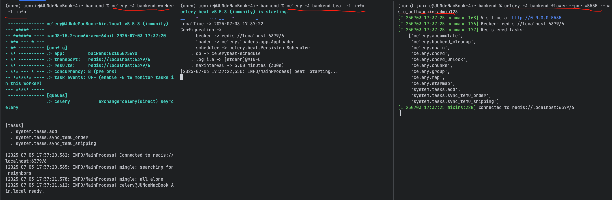

# 项目简介

本项目为基于 Django5 + Vue3（vben-admin）全栈开发的企业级中后台管理系统，支持动态菜单、按钮权限、自动化代码生成、前后端权限联动等功能，适用于多角色、多权限场景的管理后台。

## 在线体验

- admin/admin123  
- chenze/admin123
演示地址：http://demo.ywwuzi.cn
文档地址：待完成


# 许可证

本项目遵循 MIT License。
它是一个完全开源的快速开发平台，个人、团体使用免费，Django-Vue3-Admin 是一个基于 RBAC（基于角色的访问控制）模型进行权限控制的全面基础开发平台，权限控制粒度达到列级。它遵循前后端分离的架构，后端使用 Django 和 Django Rest Framework，前端使用 Vue3、Composition API、TypeScript、Vite 和 vben-admin（Ant Design Vue）。

# 启动说明
python 版本 3.12

node 版本v22.17.0
## 后端启动

0. 修改数据库配置：
   打开 backend/backend/settings.py，找到 DATABASES，根据实际情况修改数据库连接信息（如主机、端口、用户名、密码、数据库名等）。
   ```python
   DATABASES = {
    'default': {
        'ENGINE': 'django.db.backends.mysql',
        'NAME': 'django_vue',
        'USER': 'root',
        'PASSWORD': '',
        'HOST': 'localhost',
    }
}
```
1. 进入 backend 目录：
   ```bash
   cd backend
   ```
2. 安装依赖：
   ```bash
   pip install -r requirements.txt
   ```
3. 导入数据库（默认 MySQL）：
   ```bash
   # 先在 MySQL 中创建数据库（如 django_vue）
   mysql -u root -p -e "CREATE DATABASE IF NOT EXISTS django_vue DEFAULT CHARSET utf8mb4 COLLATE utf8mb4_unicode_ci;"
   # 导入数据
   mysql -u root -p django_vue < ../sql/django_vue.sql
   ```
   sql 文件位于 sql/django_vue.sql。
   如需更换数据库类型，请修改 backend/backend/settings.py 中的数据库配置。
4. 启动服务：
   ```bash
   python manage.py runserver
   ```


## (可选)Django 项目中启动 Celery 的标准方法如下：
### Celery 任务队列与监控
### 启动 Celery Worker


```bash
celery -A backend worker -l info
```

### 启动 Celery Beat（如有定时任务）
定时任务配置在 `backend/backend/settings.py` 的 `CELERY_BEAT_SCHEDULE`。
```python
CELERY_BEAT_SCHEDULE = {
    'every-1-minutes': {
        'task': 'system.tasks.sync_temu_order',  # 任务路径
        'schedule': 60,  # 每1分钟执行一次
    },
}
```
```bash
celery -A backend beat -l info
```

### 启动 Flower 监控

```bash
celery -A backend flower --port=5555 --basic_auth=admin:admin123
```

- `--port=5555`：指定 Flower 的访问端口（可自定义）
- `--basic_auth=用户名:密码`：设置访问 Flower 的账号密码（如 admin:admin123）

启动后，浏览器访问 [http://localhost:5555](http://localhost:5555) ，输入账号密码即可进入 Celery 任务监控界面。


---


## 前端启动（以 web-antd 为例）

> 说明：web-ele 目前暂不支持，待 InputPassword 等组件开发完毕后再兼容。

1. 进入前端目录：
   ```bash
   cd web/apps/web-antd
   ```
2. 安装依赖：
   ```bash
   pnpm install
   # 或 npm install / yarn install
   ```
3. 启动开发服务：
   ```bash
   pnpm dev
   # 或 npm run dev / yarn dev
   ```

# 技术架构

- **后端**：Django + Django REST framework
- **前端**：Vue3 + Vite + vben-admin（Ant Design Vue）
- **数据库**：默认 MySQL，可扩展为 PostgreSQL

# 后端技术栈

- Python 3.12+
- Django 5.x
- Django REST framework
- Celery（可选，任务队列）
- 角色/菜单/按钮权限模型
- 自动化菜单/权限生成脚本

# 前端技术栈

- Vue3
- Vite
- TypeScript
- Pinia（状态管理）
- Ant Design Vue
- vben-admin 组件库
- 动态路由与权限指令

# 功能特点

- 动态菜单与多级路由，支持后端驱动
- 按钮级别权限控制，支持 v-permission 指令
- 角色多对多、权限灵活分配
- 自动化脚本生成菜单与权限
- 通用权限校验，支持接口级、按钮级
- 登录日志、操作日志
- 支持多端适配与主题切换
- 代码生成器辅助开发
